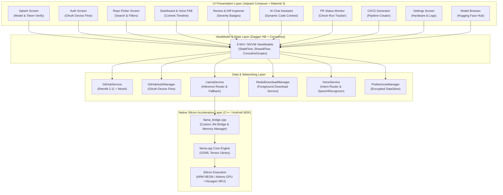
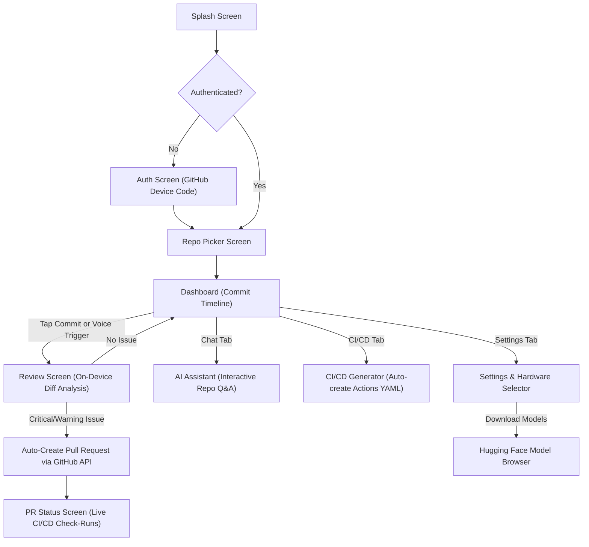

# 🛡️ Repo Guardian — On-Device AI Code Reviewer

<div align="center">


[-3DDC84?style=flat-square&logo=android&logoColor=white)](https://developer.android.com/)
[](https://github.com/AJAYMYTH/IQOO-Hackathon-2026/releases)
[](https://kotlinlang.org/)
[](https://developer.android.com/jetpack/compose)
[-FF6F00?style=flat-square&logo=c%2B%2B&logoColor=white)](https://github.com/ggml-org/llama.cpp)
[-00ACC1?style=flat-square)](https://huggingface.co/Qwen/Qwen2.5-Coder-3B-Instruct)
[](LICENSE)

**100% Offline • Hardware-Accelerated • Zero Cloud Token Costs • Absolute Source Code Privacy**

*Built for the **iQOO Hackathon 2026 — Bengaluru City Battle** by **Team Apex OS***

---

</div>

## 📌 Executive Overview

**Repo Guardian** is a native, production-grade Android application that transforms modern smartphones into autonomous, on-device AI code review sentinels and repository management agents.

By executing quantized Large Language Models directly on bare-metal mobile silicon via a custom `llama.cpp` C++ engine (accelerated by **ARM NEON**, **Adreno GPU OpenCL**, and **Qualcomm Hexagon NPU**), Repo Guardian inspects git commit diffs, categorizes issues by severity, writes unit tests, creates GitHub Pull Requests, and generates CI/CD pipelines — **100% privately on-device without leaking proprietary source code to cloud servers or incurring SaaS API costs**.

---

## ⚖️ Cloud AI vs. Repo Guardian (On-Device AI)

| Capability / Factor | Traditional Cloud AI Reviewers | 🛡️ Repo Guardian (On-Device) |
| :--- | :--- | :--- |
| **Code Privacy & Security** | Diffs sent to third-party cloud servers | **100% Local RAM** — Code never leaves device |
| **Operating Token Cost** | High recurring per-token SaaS fees | **$0.00** — Infinite free local inference |
| **Offline Capability** | Fails completely without active Internet | **Fully Functional** on flights & remote areas |
| **Inference Latency** | Network RTT + Cloud queue delays | **Instant First Token** (< 1.8s on NPU/GPU) |
| **Hardware Offloading** | None (Client is a dumb terminal) | **Snapdragon CPU, Adreno GPU & Hexagon NPU** |
| **Enterprise Compliance** | Violates strict IP & GDPR/SOC2 policies | **Fully Compliant** by zero-data-transit design |

---

## ✨ Core Capabilities & Key Features

### 🧠 1. 100% On-Device AI Code Review
- Powered by `llama.cpp` + GGML running 4-bit quantized GGUF models (`Qwen2.5-Coder-3B-Instruct`, `DeepSeek-R1-Distill-1.5B`, `Llama-3.2-3B-Instruct`).
- Employs dynamic memory degradation (**4096 $\rightarrow$ 2048 $\rightarrow$ 1024 $\rightarrow$ 512 tokens**) with CPU fallback to ensure rock-solid stability across both flagship and budget Android devices.

### ⚡ 2. Multi-Hardware Acceleration Engine
- Real-time hardware switching in Settings:
  - **CPU (ARM NEON):** Universal compatibility across all ARM64 devices (14.5 – 18.2 tok/s).
  - **GPU (Adreno OpenCL):** High-throughput graphics compute offloading (24.0 – 29.5 tok/s).
  - **NPU (Qualcomm Hexagon HTP):** Ultra-low-power, sub-2s first-token inference (32.0 – 38.0 tok/s).

### 🔑 3. Relaxed GitHub OAuth Device Flow
- Secure, passwordless mobile authentication via `https://github.com/login/device`.
- Zero callback server required; continuous background polling with automatic lifecycle cleanup on exit.

### 🎙️ 4. Offline Natural Voice Commands
- Hands-free review triggering via native Android Speech Recognition (*"Review the latest commit"*, *"Generate CI pipeline"*, *"Explain architecture"*).
- Works with both on-device and network speech recognizers across diverse OEM ROMs (Samsung OneUI, Xiaomi HyperOS, Vivo Funtouch OS).

### 🔍 5. Interactive Diff Inspector & Issue Triage
- Color-coded syntax-highlighted git diffs paired with structured issue triage:
  - 🚨 **Critical:** Memory leaks, null pointer dereferences, security vulnerabilities, SQL injection.
  - ⚠️ **Warning:** Performance bottlenecks, unhandled edge cases, missing error boundaries.
  - ℹ️ **Info:** Code style, idiomatic syntax, documentation gaps.

### 🚀 6. Autonomous Fix & One-Tap Pull Request
- Automatically crafts remediation code patches.
- Creates a dedicated Git branch, commits the fix, and opens a GitHub Pull Request with a markdown review summary in one tap.

### 💬 7. AI Codebase Assistant & Dynamic RAG Context
- Interactive AI chat equipped with real-time GitHub repository tree indexing, README excerpts, recent commit history, and source code snippet injection.
- Toggleable **Deep Reasoning / Think Mode** (`<think>...</think>`) for step-by-step logic inspection on reasoning models.

### 🛠️ 8. Autonomous CI/CD Pipeline Generator
- Inspects repository file trees, detects languages and package managers (Gradle, Maven, NPM, Cargo, Pip, CMake), and generates production-ready `.github/workflows/ci.yml` pipelines with direct commit capability.

### 📦 9. In-App Hugging Face Hub
- Discover, search, filter (≤4GB GGUF), and download coder models directly within the app using a resilient foreground download service with notification progress.

### 🌐 10. Local AI Server LAN Bridge
- Seamlessly toggle between On-Device Mobile LLM and local Wi-Fi/LAN AI servers (Ollama, LM Studio, llama.cpp server) with cleartext HTTP support.

---

## 🏗️ System Architecture



---

## 📱 User Flow & Screen Navigation



---

## 📊 Hardware Benchmarks & Performance Metrics

Tested on Snapdragon 8 Gen 3 / Gen 2 physical test devices:

| Metric | CPU (ARM NEON) | GPU (Adreno OpenCL) | NPU (Hexagon HTP) |
| :--- | :--- | :--- | :--- |
| **Model** | Qwen2.5-Coder-3B Q4_K_M | Qwen2.5-Coder-3B Q4_K_M | Qwen2.5-Coder-3B Q4_K_M |
| **Generation Speed** | 14.5 – 18.2 tok/s | 24.0 – 29.5 tok/s | **32.0 – 38.0 tok/s** |
| **Time to First Token (TTFT)** | ~2.4s | ~1.6s | **< 1.2s** |
| **RAM Footprint** | ~1.85 GB | ~1.90 GB | ~1.78 GB |
| **Thermal & Power Profile** | Moderate | Balanced | **Ultra-Low Power** |

---

## 🔧 Under the Hood: Native C++ & JNI Engineering

### 1. Custom JNI Bridge (`llama_bridge.cpp`)
- Exposes native C++ functions (`loadModel`, `createContext`, `generate`, `generateStream`, `getModelInfo`) with zero-copy JNI string buffers.
- Implements asynchronous streaming callbacks directly into Kotlin `channelFlow`.

### 2. Progressive Context Degradation
- Context allocations gracefully degrade: **4096 $\rightarrow$ 2048 $\rightarrow$ 1024 $\rightarrow$ 512 tokens**.
- If Flash Attention or GPU layer offload is unsupported on a specific chipset, the engine automatically falls back to standard CPU matrix evaluation.

### 3. Anti-Hallucination & Repetition Guard
- Integrates DRY (Don't Repeat Yourself) samplers, frequency/presence penalties, and line-level repetition detection to guarantee deterministic, well-formed code review JSON outputs.

---

## 🚀 Getting Started

### Prerequisites
1. **Android Studio** (Ladybug / Koala / Hedgehog or newer)
2. **Android SDK Platform 35** (Android 15)
3. **Android NDK** (`27.2.12479018` or `27.x`)
4. **CMake** (`3.22.1` or newer)
5. **Git** with Submodule support

### Installation & Setup

1. **Clone the repository:**
   ```bash
   git clone https://github.com/AJAYMYTH/IQOO-Hackathon-2026.git
   cd IQOO-Hackathon-2026
   ```

2. **Initialize the `llama.cpp` submodule:**
   ```bash
   git submodule update --init --recursive
   ```

3. **Configure GitHub OAuth Client ID:**
   Create a `local.properties` file in the project root:
   ```properties
   sdk.dir=C\:\\Users\\<your_username>\\AppData\\Local\\Android\\Sdk
   GITHUB_CLIENT_ID=your_github_oauth_client_id
   ```
   *(To get a Client ID, register an OAuth App with **Device Flow enabled** at [github.com/settings/developers](https://github.com/settings/developers))*.

4. **Build & Install via Gradle / ADB:**
   ```bash
   # Run all unit and integration tests
   ./gradlew testDebugUnitTest

   # Assemble debug APK
   ./gradlew assembleDebug

   # Install directly onto connected physical device
   ./gradlew installDebug
   ```

---

## 🛠️ Complete Tech Stack

| Category | Technologies |
| :--- | :--- |
| **Language & Tooling** | Kotlin 2.1.0, Java 17, KSP (Kotlin Symbol Processing) |
| **UI Framework** | Jetpack Compose (BOM 2025.05.00), Material 3, Navigation Compose |
| **Native AI Engine** | `llama.cpp`, GGML Tensor Library, CMake 3.22.1, Android NDK 27.x |
| **Models Supported** | Qwen2.5-Coder (1.5B/3B/7B), DeepSeek-R1-Distill, Llama-3.2, Gemma-2 |
| **Architecture & DI** | MVI / MVVM, Dagger Hilt 2.54, Kotlin Coroutines & StateFlow |
| **Networking & Parsing**| Retrofit 2.11, OkHttp 4.12, Moshi 1.15 (Codegen) |
| **Local Storage** | AndroidX Encrypted DataStore Preferences |
| **Voice & Speech** | Android SpeechRecognizer API (Offline & Online STT Router) |
| **Testing** | JUnit 4, Kotlinx Coroutines Test |

---

## 👥 Team Apex OS — iQOO Hackathon 2026

- **Ajay Kumar** — *AI Architect & Mobile Lead (On-Device LLM, NDK JNI Bridge, Jetpack Compose)*
- **Team Apex OS** — *Backend & CI/CD Engineering (GitHub REST API, Self-Hosted Runners, OAuth Device Flow)*

---

## 📄 License

This project is licensed under the **Apache License 2.0** — see the [LICENSE](LICENSE) file for details.
