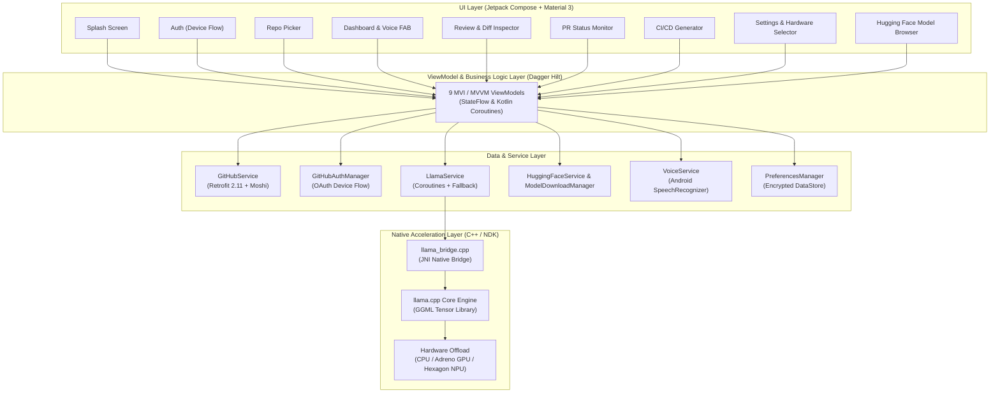
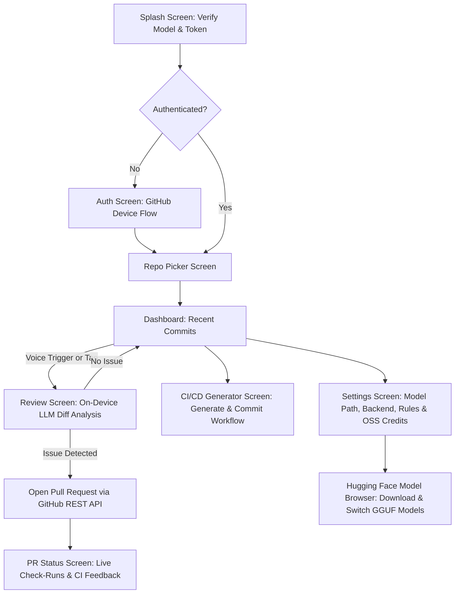

# 🛡️ Repo Guardian — On-Device AI Code Reviewer

<div align="center">


[-3DDC84?style=flat-square&logo=android&logoColor=white)](https://developer.android.com/)
[](https://kotlinlang.org/)
[](https://developer.android.com/jetpack/compose)
[-FF6F00?style=flat-square&logo=c%2B%2B&logoColor=white)](https://github.com/ggml-org/llama.cpp)
[-00ACC1?style=flat-square)](https://huggingface.co/Qwen/Qwen2.5-Coder-3B-Instruct)
[](LICENSE)

**100% Offline • Hardware-Accelerated • Zero Cloud API Costs • Total Source Code Privacy**

*Built for the iQOO Hackathon 2026 — Bengaluru City Battle by **Team Apex OS***

---

</div>

## 📌 Overview

**Repo Guardian** is a native Android application that turns your smartphone into an autonomous, on-device AI code review and repository guardian agent. 

By executing lightweight Large Language Models directly on mobile hardware via `llama.cpp` (with ARM NEON, Adreno GPU OpenCL, and Qualcomm Hexagon NPU acceleration), Repo Guardian inspects incoming commits, highlights bugs, security vulnerabilities, and anti-patterns, generates structured fixes, and opens GitHub Pull Requests — **completely offline without sending proprietary code diffs to third-party cloud servers**.

---

## ✨ Key Features

- 🧠 **100% On-Device AI Inference:** Powered by `llama.cpp` C++ engine running 4-bit quantized GGUF models (`Qwen2.5-Coder-3B-Instruct`) with sub-2.5s first-token latency.
- ⚡ **Multi-Hardware Backend Switching:** Seamless runtime selection between **CPU (ARM NEON)**, **GPU (Adreno OpenCL)**, and **NPU (Qualcomm Hexagon HTP)**.
- 🔑 **GitHub OAuth Device Flow:** Secure, passwordless mobile authentication via `https://github.com/login/device` with zero redirect server requirement.
- 🎙️ **Offline Voice Trigger:** Hands-free code analysis triggered by natural phrases (*"Hey, review the latest commit"*) using Android's native on-device speech engine.
- 🔍 **Interactive Diff Viewer & Analysis:** Syntax-highlighted git diffs paired with structured issue severity badges (Critical, Warning, Info).
- 🚀 **Automated PR Creation Loop:** One-tap Git branch creation, automated code patching, and GitHub Pull Request submission.
- 🔄 **Live CI/CD Check-Run Monitor:** Real-time polling and status visualization for GitHub Actions self-hosted runners with graceful fallback.
- 🛠️ **Autonomous CI/CD Generator:** Inspects repository language and automatically generates tailored `.github/workflows/ci.yml` pipelines.
- 📦 **In-App Hugging Face Browser:** Discover, filter (≤4GB GGUF), and download code models with live streaming progress directly on device.
- 📋 **Customizable Review Rules:** Developer-configurable rules (e.g., memory leak prevention, strict typing, credentials checks).

---

## 🏗️ System Architecture



---

## 📱 Screen Inventory & User Flow



| Screen | Purpose | Key Components |
| :--- | :--- | :--- |
| **Splash** | Verifies on-device model and stored credentials | Background initializer, dynamic progress ring |
| **Auth** | Passwordless GitHub OAuth Device Flow | 8-character user code, clipboard copy, instant browser launch |
| **Repo Picker** | Repository selection | Search filter, language chips, public/private indicators |
| **Dashboard** | Commit timeline and voice trigger | Monospace commit SHAs, author metadata, pulsing voice FAB |
| **Review** | Core code review interface | Additions/deletions diff card, severity badges, automated fix button |
| **PR Status** | Live CI validation loop tracker | Check-run conclusion icons, runner polling, graceful offline indicator |
| **CI/CD Generator** | DevOps pipeline creator | Automatic language detection, editable YAML card, direct commit |
| **Settings** | Hardware engine & model configurations | CPU/GPU/NPU selector with pros/cons, custom review rules |
| **Model Browser** | On-device model manager | Hugging Face GGUF search, size filtering, download stream |

---

## 🧠 Why `llama.cpp`?

1. **Pure Native Execution:** Compiles directly to bare-metal C++ machine code via Android NDK without heavy runtime dependencies.
2. **100% Offline Privacy:** Protects intellectual property by processing confidential code diffs locally on the phone.
3. **Optimized Quantization (GGUF Q4_K_M):** Enables 3B coding models to run within a lightweight **~1.8 GB RAM footprint** with rapid generation.
4. **Hardware Acceleration:** Takes advantage of Snapdragon processors via OpenCL and Hexagon NPU offloading.

### What We Built on Top of `llama.cpp`:
- **`llama_bridge.cpp` JNI Bridge:** Non-blocking asynchronous JNI bridge binding C++ tokenization and generation loops directly into Kotlin Coroutines.
- **`PromptBuilder.kt` ChatML Engine:** Formats git patches into compact prompt structures enforcing structured JSON outputs for PR creation.
- **Dynamic Hardware Router:** Instant switching between CPU, Adreno GPU, and Hexagon NPU with fallback protection.
- **In-App Model Manager:** Native downloader for quantized GGUF models directly from the Hugging Face Hub.

---

## 🚀 Getting Started

### Prerequisites

1. **Android Studio** (Ladybug / Koala / Hedgehog or newer)
2. **Android SDK Platform 35** (Android 15 / VanillaIceCream)
3. **Android NDK** (`27.2.12479018` or `27.x`)
4. **CMake** (`3.22.1` or newer)
5. **Git**

### Installation & Setup

1. **Clone the repository:**
   ```bash
   git clone https://github.com/AJAYMYTH/IQOO-Hackathon-2026.git
   cd IQOO-Hackathon-2026
   ```

2. **Initialize the `llama.cpp` submodule:**
   ```bash
   git submodule add https://github.com/ggml-org/llama.cpp.git llama.cpp
   ```

3. **Configure GitHub OAuth Client ID:**
   Create a `local.properties` file in the project root:
   ```properties
   sdk.dir=C\:\\Users\\<your_username>\\AppData\\Local\\Android\\Sdk
   GITHUB_CLIENT_ID=your_github_oauth_client_id
   ```
   *(To get a Client ID, register an OAuth App with **Device Flow enabled** at [github.com/settings/developers](https://github.com/settings/developers))*.

4. **Build & Run:**
   - Open the project in **Android Studio**.
   - Let Gradle sync dependencies.
   - Select your connected device or emulator and press **Run (▶)** (or `Shift + F10`).

---

## 🛠️ Tech Stack

- **Language:** Kotlin 2.1.0
- **UI Framework:** Jetpack Compose with Material 3
- **Inference Engine:** `llama.cpp` + GGML (C++ via Android NDK)
- **Primary Model:** `Qwen2.5-Coder-3B-Instruct` (GGUF Q4_K_M)
- **Dependency Injection:** Dagger Hilt 2.54 + KSP
- **Networking:** Retrofit 2.11 + OkHttp 4.12 + Moshi 1.15
- **Local Storage:** AndroidX Encrypted DataStore Preferences
- **Speech Recognition:** Android SpeechRecognizer API (On-Device Offline STT)
- **Build System:** Gradle Kotlin DSL (AGP 8.7.3) + CMake 3.22.1

---

## 📄 License

This project is licensed under the **Apache License 2.0** — see the [LICENSE](LICENSE) file for details.

---

## 🤝 Contributing

Contributions, issues, and feature requests are welcome! Please check out [CONTRIBUTING.md](CONTRIBUTING.md) and our [CODE_OF_CONDUCT.md](CODE_OF_CONDUCT.md).

---

## 👥 Team Apex OS — iQOO Hackathon 2026

- **Mobile / On-Device AI Lead:** Jetpack Compose, JNI Bridge, `llama.cpp` & NPU Integration
- **Backend / Integration Lead:** GitHub REST API, Device OAuth Flow, Self-Hosted Runner Validation Loop
- **Product & Pitch Lead:** UI/UX Design, Presentation & Technical Demo Orchestration
