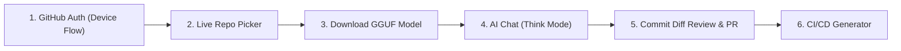

# 🛡️ Repo Guardian — Team Build, Device Setup & Testing Guide

> **Official Developer & Teammate Setup Guide for iQOO Hackathon 2026**  
> *Everything you need to clone, compile, deploy onto physical Android devices, and test all on-device AI features.*

---

## 📋 Table of Contents
1. [Prerequisites & Development Environment](#1-prerequisites--development-environment)
2. [Cloning & Local Configuration](#2-cloning--local-configuration)
3. [Building the Application (Gradle)](#3-building-the-application-gradle)
4. [Deploying onto Physical Android Device](#4-deploying-onto-physical-android-device)
5. [End-to-End On-Device Testing Checklist](#5-end-to-end-on-device-testing-checklist)
   - [A. GitHub Authentication (Device Flow)](#a-github-authentication-device-flow)
   - [B. Live Repository Ingestion](#b-live-repository-ingestion)
   - [C. On-Device GGUF Model Download & Loading](#c-on-device-gguf-model-download--loading)
   - [D. AI Assistant, Think Mode & Markdown Cards](#d-ai-assistant-think-mode--markdown-cards)
   - [E. Code Review, Diff Auditing & 1-Tap PRs](#e-code-review-diff-auditing--1-tap-prs)
   - [F. Automated CI/CD Generation](#f-automated-cicd-generation)
6. [CI/CD Pipelines & GitHub Releases](#6-cicd-pipelines--github-releases)
7. [Hardware Acceleration & Settings](#7-hardware-acceleration--settings)
8. [Troubleshooting & Common FAQs](#8-troubleshooting--common-faqs)

---

## 1. Prerequisites & Development Environment

Ensure your development machine has the following installed:

| Tool | Recommended Version | Purpose |
| :--- | :--- | :--- |
| **JDK (Java Development Kit)** | **JDK 17** (Eclipse Temurin / OpenJDK 17) | Compiles Kotlin 2.1, Gradle 8.7, and Android SDK |
| **Android SDK** | API 35 (Android 15), Build-Tools 35.0.0 | Core Android compile libraries |
| **Android NDK & CMake** | NDK `27.0.12077973`, CMake `3.22.1+` | Builds C++ `llama.cpp` JNI bindings |
| **Android Platform Tools** | Latest `adb` | Communicates with physical devices |
| **Git CLI** | 2.40+ | Version control & GitHub Actions triggering |
| **Physical Device** | **iQOO 15** / Snapdragon Android (API 28+) | On-device inference and UI testing |

---

## 2. Cloning & Local Configuration

### 1. Clone the Repository
```bash
git clone https://github.com/AJAYMYTH/IQOO-Hackathon-2026.git
cd IQOO-Hackathon-2026
```

### 2. Configure `local.properties`
Create or edit `local.properties` in the root directory and specify your Android SDK path:

#### On Windows:
```properties
sdk.dir=C:\\Users\\<YOUR_USERNAME>\\AppData\\Local\\Android\\Sdk
```

#### On macOS / Linux:
```properties
sdk.dir=/Users/<YOUR_USERNAME>/Library/Android/sdk
# or
sdk.dir=/home/<YOUR_USERNAME>/Android/Sdk
```

### 3. Verify JDK 17
Check your active Java version:
```bash
java -version
# Should output java version "17.0.x"
```
*(If you have multiple JDKs installed, set your `JAVA_HOME` environment variable to JDK 17).*

---

## 3. Building the Application (Gradle)

### A. Run Unit Tests
```bash
# Windows
.\gradlew.bat testDebugUnitTest

# macOS / Linux
chmod +x gradlew
./gradlew testDebugUnitTest
```

### B. Compile Debug APK
```bash
# Windows
.\gradlew.bat assembleDebug

# macOS / Linux
./gradlew assembleDebug
```
*The compiled binary will be generated at:*  
`app/build/outputs/apk/debug/app-debug.apk`

### C. Compile Release APK
```bash
# Windows
.\gradlew.bat assembleRelease

# macOS / Linux
./gradlew assembleRelease
```
*The release binary will be generated at:*  
`app/build/outputs/apk/release/app-release-unsigned.apk`

---

## 4. Deploying onto Physical Android Device

### 1. Enable Developer Options & USB Debugging
1. On your phone (e.g. **iQOO 15**), open **Settings > About Phone > Software Information**.
2. Tap **Build Number** 7 times until Developer Mode is unlocked.
3. Go to **Settings > System > Developer Options**.
4. Enable **USB Debugging** (and **Install via USB** if prompted).

### 2. Connect Device & Authorize ADB
Connect your phone via USB-C and run:
```bash
adb devices
```
*You should see your device serial (e.g., `10BFAX1BNR0010U  device`). If it says `unauthorized`, look at your phone screen and tap **Always Allow from this Computer**.*

### 3. Install the APK directly via ADB
```bash
# Install with -r (reinstall / replace existing app while keeping data)
adb install -r app/build/outputs/apk/debug/app-debug.apk
```

### 4. Launch Repo Guardian
```bash
adb shell am start -n com.apexos.repoguardian/.MainActivity
```

---

## 5. End-to-End On-Device Testing Checklist

Follow these steps on your phone to test the full feature suite:



---

### A. GitHub Authentication (Device Flow)
1. Launch the app. If you are not logged in, the **GitHub Device Flow** screen appears.
2. Tap **Copy Code & Open GitHub Login**.
3. Your phone copies the 8-character user code (e.g. `XXXX-XXXX`) and opens `https://github.com/login/device` in your mobile browser.
4. Paste the code, authorize Repo Guardian, and return to the app.
5. The app automatically polls OAuth tokens, logs in securely, and advances to the repository dashboard.

---

### B. Live Repository Ingestion
1. Tap the repository dropdown in the Top App Bar.
2. Select any repository from your GitHub account (e.g. `ajaymyth/ajaymyth`, `IQOO-Hackathon-2026`, etc.).
3. The app dynamically fetches:
   - Primary language & description (`GET /repos/{owner}/{repo}`).
   - Root directory files and folders (`GET /repos/{owner}/{repo}/contents`).
   - Remote README highlights (`GET /repos/{owner}/{repo}/readme`).
   - Recent commit logs (`GET /repos/{owner}/{repo}/commits`).

---

### C. On-Device GGUF Model Download & Loading
1. Navigate to **AI Models Manager** (top bar chip or Settings > Models).
2. **Storage Pre-Check:** The app automatically checks free device storage (`usableSpace >= modelSize + 100MB`).
3. **Background Foreground Download:**
   - Tap **Download** on any quantized model (e.g. `Qwen2.5-Coder 0.5B` ~469MB or `1.5B`).
   - Grant the `POST_NOTIFICATIONS` runtime permission.
   - The app streams chunks (64KB buffer) with a live notification progress bar (Speed MB/s, ETA, and percentage).
   - If you press Back while downloading, a safety dialog confirms background execution.
4. Once completed, tap **Load Model** to set it active.

---

### D. AI Assistant, Think Mode & Markdown Cards
1. From Dashboard or Top Bar, tap the **AI Chat** icon (`Icons.AutoMirrored.Filled.Chat`).
2. **Model Selector Dropdown:** Tap the model button in the top right (`Memory` icon) to see all downloaded models and switch between them instantly.
3. **Repo Context Switcher:** Switch between your GitHub repositories in the top left dropdown.
4. **Deep Think Mode (`Think ON` / `Think OFF`):**
   - When **Think ON** is enabled, the AI generates step-by-step reasoning inside an expandable **Deep Reasoning Process** card (`Icons.Default.Psychology`).
   - Tap the chevron (`ExpandLess` / `ExpandMore`) to collapse or expand the chain of thought.
5. **Markdown & Code Cards:**
   - Responses are rendered in rich Markdown: Headers, bold/italics, bulleted lists, and dark syntax code cards.
   - Tap **Copy Code** (`Icons.Default.ContentCopy`) on any code block to copy to your clipboard.
6. **Quick Prompt Chips:**
   - 📖 **Explain Repo:** Explains the selected repository's real architecture, detected stack (Android/Gradle, Node.js, Python, Rust, Go), root files, and commits.
   - 🐛 **Review Commits:** Audits recent commit diffs.
   - 💻 **Generate CI/CD:** Creates production-ready GitHub Actions YAML.
   - 📋 **Write Unit Tests:** Generates complete test specifications.
   - 🔒 **Security Audit:** Analyzes permissions, API hygiene, and branch protection.

---

### E. Code Review, Diff Auditing & 1-Tap PRs
1. From the Dashboard, select any recent commit.
2. The app fetches the real diff patch via GitHub API.
3. On-device LLM inspects line-by-line changes for:
   - Unsafe non-null assertions (`!!`).
   - Blocking calls in coroutines / UI threads (`Thread.sleep`, `runBlocking`).
   - Unscoped coroutine launches (`GlobalScope`).
4. Tap **1-Tap Fix PR** to automatically create a fix branch, commit the corrected code, and submit a GitHub Pull Request!

---

### F. Automated CI/CD Generation
1. In the Dashboard or Chat, request a CI/CD pipeline.
2. The AI inspects your repo files (`build.gradle.kts`, `package.json`, `requirements.txt`, etc.) and generates a tailored workflow.
3. Tap **Commit to Repo** to write `.github/workflows/ci.yml` directly to your GitHub repository.

---

## 6. CI/CD Pipelines & GitHub Releases

Our automated GitHub Actions workflow automatically runs unit tests, compiles release APKs, generates SHA-256 checksums, and creates downloadable GitHub Releases.

### Triggering a New Release Build:
To publish a new official APK release, create and push a git tag starting with `v*`:

```bash
# 1. Ensure working directory is clean and pushed to main
git push origin main

# 2. Create a version tag
git tag v2.1.0 -m "Release v2.1.0: Live GitHub integration, Think Mode, Model Selector"

# 3. Push the tag to GitHub
git push origin v2.1.0
```

GitHub Actions will automatically:
1. Run `./gradlew testDebugUnitTest`.
2. Compile `./gradlew assembleRelease`.
3. Generate `checksums.txt` (SHA-256).
4. Create a new GitHub Release under **Releases** with downloadable APK binaries.

---

## 7. Hardware Acceleration & Settings

In the **Settings** screen, you can configure hardware offload options:

| Mode | Backend | Description |
| :--- | :--- | :--- |
| **CPU (ARM NEON)** | Default | High-efficiency 4-thread / 8-thread ARM NEON SIMD compute. |
| **GPU (Adreno OpenCL)** | Snapdragon GPU | Offloads 33 transformer layers to Adreno GPU for 20-30 tokens/sec. |
| **NPU (Hexagon HTP)** | Qualcomm HTP | Ultra-low power hardware tensor accelerator. |

---

## 8. Troubleshooting & Common FAQs

### Q1: ADB says `device unauthorized` or `device offline`
- Disconnect and reconnect the USB-C cable.
- Toggle **USB Debugging** off and on in Developer Options.
- Run `adb kill-server && adb start-server`.
- Accept the RSA fingerprint prompt on your phone screen.

### Q2: Gradle build fails with `JAVA_HOME is not set`
- Ensure JDK 17 is installed.
- In PowerShell:
  ```powershell
  $env:JAVA_HOME="C:\Program Files\Eclipse Adoptium\jdk-17.0.x"
  .\gradlew.bat assembleDebug
  ```

### Q3: Model download stops when screen turns off
- The app uses Android's `FOREGROUND_SERVICE_DATA_SYNC` and `WAKE_LOCK`. Ensure you have granted **Notification Permissions** (`POST_NOTIFICATIONS`) so the foreground service notification stays alive in the background.

### Q4: How do I test with custom GGUF models?
- You can push any standard GGUF model directly to your phone storage:
  ```bash
  adb push my-model-q4_k_m.gguf /sdcard/Download/
  ```
- Open **Settings > Model Path** in Repo Guardian and enter `/sdcard/Download/my-model-q4_k_m.gguf`.

---

<div align="center">
<b>Repo Guardian — Built by Team Apex OS for iQOO Hackathon 2026</b>
</div>
