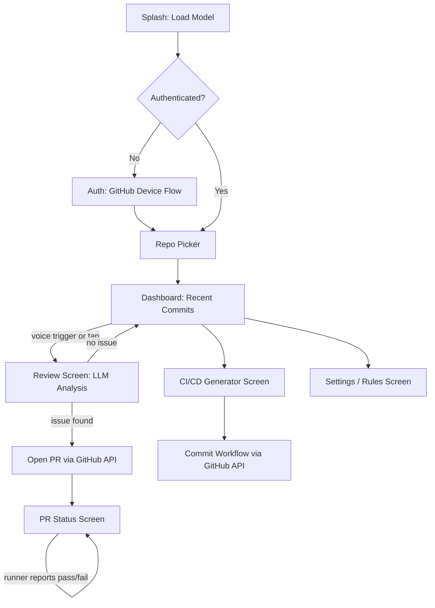

# Navigation Plan
## On-Device Repo Guardian — Screen & Flow Map
**Team Apex OS · iQOO Hackathon 2026**

---

## 1. Screen Inventory

| Screen | Purpose | Built during |
|---|---|---|
| Splash / Launch | Load MLCEngine, check model is present | Red Light |
| Auth (GitHub Device Flow) | Show device code, poll for token | Red Light |
| Repo Picker | List repos via `GET /user/repos`, select one | Red Light |
| Dashboard | Show recent commits for selected repo, voice-trigger button | Red Light |
| Review Screen | Shows LLM's analysis of a commit/diff, proposed fix, "Open PR" action | Red Light |
| PR Status Screen | Shows opened PR link, check-run status (pass/fail from self-hosted runner) | Green Light (status depends on runner, which is Green Light only) |
| CI/CD Generator Screen | Detected repo type, generated workflow YAML preview, "Commit workflow" action | Green Light |
| Settings / Rules Screen | Edit `.repoguardian/rules.md`-style custom rules, model selection (3B/1.5B) | Red Light |

## 2. Flow Diagram

## 3. Navigation Rules

- **Back button** always returns to Dashboard except from Splash/Auth (no back target)
- **Voice trigger** is only active on the Dashboard screen — keeps scope tight, avoids ambiguous "what did the voice command just do" moments mid-flow
- **Settings/Rules screen** is reachable from Dashboard only — not buried in a nested menu, since judges may want to see it during the demo to understand customization
- **PR Status Screen** should gracefully show "waiting for laptop runner" state if opened during Red Light (no runner active) rather than looking broken — this is a required state, not an edge case, given the format

## 4. Demo Path (what to actually walk judges through)

Splash → Dashboard (already authenticated, pre-selected repo) → tap/voice-trigger review → Review Screen shows detected issue → Open PR → PR Status Screen shows verified fix → quick cut to CI/CD Generator Screen for the second feature. Everything else (auth flow, repo picker, settings) should work but doesn't need to be part of the live walkthrough — pre-authenticate before your demo slot.
